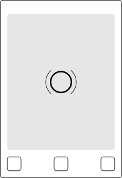
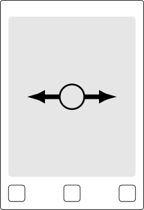
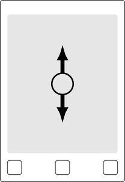

# rmvncclient

A simple [VNC](https://en.wikipedia.org/wiki/Virtual_Network_Computing) client for the [reMarkable tablet](https://remarkable.com) allowing you to turn the device into an external screen for your computer.

VNC is a desktop-sharing system that enables a client to see the screen of another computer and act on it remotely.
It is a well-established protocol supporting multiple platforms including Windows, Linux and Android.
The reMarkable is a writer tablet featuring an E-Ink display, Wacom pen digitizer and a touchscreen, that can be used for reading, sketching or note-taking.
It runs Linux and is open to hacking.

rmvncclient brings both worlds together by allowing the tablet to connect to a remote VNC server, show the computer’s screen on its E-Ink display and interact with it through the touchscreen.
This effectively turns the tablet into an external screen for your computer.
Applications include reading web-based documents, writing inside an editor or previewing your [LaTeX documents](https://www.latex-project.org/) as you compose them.

* [Installation](#installation)
* [Running](#running)
    - [Linux (X11 with xrandr)](#linux-x11-with-xrandr)
    - [Linux (Wayland) — _Help wanted!_](#linux-wayland)
    - [Windows — _Help wanted!_](#windows)
    - [macOS — _Help wanted!_](#macos)
* [Related work](#related-work)
* [License](#license)

## Installation

Grab the latest build from the releases page (or build the software yourself by following the [build guide](BUILD.md)), then copy the `rmvncclient` executable to the tablet by [using SSH](https://remarkablewiki.com/tech/ssh).

## Running

You will first need a VNC server to connect to that is configured for the reMarkable resolution (1408 × 1872 pixels).
This is an important limitation: if the server sends an incompatible resolution, this client will exit immediately because it does no image processing for simplicity and efficiency reasons.

A common scenario is using the tablet as an external screen for the computer it is attached to through USB (or via Wi-Fi).
For this scenario, you will need to start a VNC server on your computer.

### Linux (X11 with xrandr)

Create a new mode compatible with the tablet’s resolution and add this mode to the `VIRTUAL1` output.

```sh
xrandr --newmode 1408x1872 $(gtf 1408 1872 60 | tail -n2 | head -n1 | tr -s ' ' | cut -d' ' -f4-)
xrandr --addmode VIRTUAL1 1408x1872
```

Enable and arrange the `VIRTUAL1` output through your usual dual screen configuration program, for example GNOME’s settings, arandr or xrandr directly.
Then, start the x11vnc server (you will need to install this package first if needed).

```sh
x11vnc -repeat -forever -clip $(xrandr | awk '/VIRTUAL1 connected/{print $3}') -nocursor
```

> _Alternative: Flip the screen upside down_
>
> ```sh
> x11vnc -rotate xy -repeat -forever -clip $(xrandr | awk '/VIRTUAL1 connected/{print $3}') -nocursor
> ```

Finally, start rmvncclient using SSH.

```sh
ssh root@10.11.99.1 "systemctl stop xochitl && ./rmvncclient"
```

**Note:** If you get a message saying that the `Server uses an unsupported resolution`, you did not configure your screen correctly. Please make sure the `VIRTUAL1` output is enabled.

### Linux (Wayland)

(Help wanted!)

### Windows

(Help wanted!)

### macOS

(Help wanted!)

## Using

While the client is running, frames will be displayed on the tablet’s screen as they are received from the server.
Due to the properties of E-Ink, there will be some extra latency (up to 1 s) between the time of a change on the computer and the moment it appears on the screen.
Activity on the touchscreen will be translated to mouse interactions following the mapping in the table below.

<table>
<tr>
<th colspan="3">
    Interaction mapping
</th>
</tr>
<tr>
<td align="center">
    <br>
    Tap ⇒ Left click
</td>
<td align="center">
    <br>
    Horizontal swipe ⇒ Horizontal scroll
</td>
<td align="center">
    <br>
    Vertical swipe ⇒ Vertical scroll
</td>
</tr>
</table>

## Related work

- [A Hacker News comment requesting a VNC client for the reMarkable.](https://news.ycombinator.com/item?id=13115739)
- [A currently-unfinished previous attempt at building a VNC client for the tablet.](https://github.com/damienchallet/vnc-remarkable)
- [libremarkable](https://github.com/canselcik/libremarkable), which was used as the basis for some input/output handling.

## License

This work is licensed under the GPL v3.
