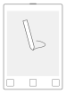

# VNSee

[VNC](https://en.wikipedia.org/wiki/Virtual_Network_Computing) client for the [reMarkable tablet](https://remarkable.com) allowing you to use the device as a second screen.\
(Previously called _rmvncclient_.)

## Disclaimer

This project is not affiliated to, nor endorsed by, [reMarkable AS](https://remarkable.com/).\
**I assume no responsiblitiy for any damage done to your device due to the use of this software.**

## Background

VNC is a desktop-sharing system that enables a client to see the screen of another computer and act on it remotely.
It relies on a well-established protocol supporting multiple platforms including Windows, Linux and Android.
The reMarkable is a writer tablet featuring an E-Ink display, a Wacom pen digitizer and a touchscreen, that can be used for reading, sketching or note-taking.
It runs a fully open, Linux-based, system.

VNSee brings both worlds together by allowing the tablet to connect to a remote VNC server, show the remote screen on its E-Ink display and interact with it through the pen digitizer and touchscreen.
This can effectively turn the tablet into a second screen for your computer.
Applications include reading web-based content, typing documents, drawing, or previewing [LaTeX documents](https://www.latex-project.org/) as you compose them.

## Install on the reMarkable

**The recommended way of installing VNSee is through the [Toltec package manager](https://toltec-dev.org).**
This will automatically take care of installing the required dependencies and will allow you to cleanly uninstall VNSee if needed.
After installing Toltec, simply run `opkg install vnsee` and you should be all set.
To remove VNSee, run `opkg remove vnsee`.

You can also install this program manually.
Download the latest build from the [releases page](https://github.com/matteodelabre/vnsee/releases) (or build the software yourself by following the [build guide](docs/build.md)), then copy the `vnsee` and `vnsee-gui` executables to the tablet [using SSH](https://remarkablewiki.com/tech/ssh).
If you’re using a reMarkable 2, you’ll need to setup the [remarkable2-framebuffer](https://github.com/ddvk/remarkable2-framebuffer) before proceeding.
To run `vnsee-gui`, you’ll also need to install [simple](https://rmkit.dev/apps/sas) and, optionally, [nmap](https://nmap.org/book/install.html).

This VNC client is compatible with all VNC servers that are capable of sending pixels in the RGB565 format.
It has been successfully tested with [x11vnc](https://github.com/LibVNC/x11vnc), [TigerVNC](https://github.com/TigerVNC/tigervnc), and [wayvnc](https://github.com/any1/wayvnc).
If your server’s resolution is higher than the one on the reMarkable (1404x1872 pixels), the screen will be cropped to fit, so make sure to adjust the server size beforehand.

## Setup as a Second Screen

Although this client can connect to any compatible VNC server, the most common scenario is using the tablet as a second screen for the computer it is attached to.
For this scenario, you will need to configure your system to create a virtual second screen and then start a VNC server on your computer that the tablet can connect to.

The details are specific to the operating system you’re using:

* [Linux with X11](docs/second-screen/linux-x11.md)
* [Linux with Sway](docs/second-screen/linux-sway.md)
* macOS (not officially supported yet, see [workarounds from users](https://github.com/matteodelabre/vnsee/issues/21))
* Windows (not officially supported yet, see [workarounds from users](https://github.com/matteodelabre/vnsee/issues/13))

## Using the Client

You can quit VNSee at any time using the “Power” button (the one above the screen).
Activity on the touchscreen will be translated to mouse interactions following the mapping in the table below.

<table>
<tr>
<th colspan="3">
    Interactions
</th>
</tr>
<tr>
    <td align="center">
         
        <strong>Tap</strong> → Left click 
        <strong>Long press</strong> → Right click
    </td>
    <td align="center">
         
        <strong>Horizontal swipe</strong> 
        Horizontal scroll
    </td>
    <td align="center">
         
        <strong>Vertical swipe</strong> 
        Vertical scroll
    </td>
</tr>
<tr>
    <td align="center">
         
        <strong>Home button</strong> 
        Force refresh (rM1 only)
    </td>
    <td align="center">
         
        <strong>Power button</strong> 
        Quit app
    </td>
    <td align="center" colspan="3">
         
        <strong>Draw with pen</strong> 
        Mouse click and drag
    </td>
</tr>
</table>

While the client is running, frames will be displayed on the tablet’s screen as they are received from the server.
Due to the properties of E-Ink, there will be some extra latency (up to 1s) between the time of a change on the computer and the moment it appears on the screen.
On dark background apps, there will be some ghosting on the screen: use the “Home” button (the one in the middle of the button row below the screen) to force a refresh and clear those artifacts out.

## Technologies

This client was built in C++ using [libvncserver](https://github.com/LibVNC/libvncserver), which implements the [RFB protocol](https://tools.ietf.org/html/rfc6143) behind the VNC system.

## Acknowledgments

Many thanks to:

- [libremarkable](https://github.com/canselcik/libremarkable) and [FBInk](https://github.com/NiLuJe/FBInk), on which input/output handling in this client is based.
- [Damien Challet](https://github.com/damienchallet) and [Qwertystop](https://news.ycombinator.com/item?id=13115739) for providing the inspiration of a VNC client for the reMarkable.
- The [Discord developer community](https://discord.gg/JSSGnFY) for providing initial feedback and testing.
- [Florian Magin](https://github.com/fmagin) for contributing a driver-generic way of setting up Linux/X11 systems.
- [@asmanur](https://github.com/asmanur) for improving the repaint latency.
- [@mhhf](https://github.com/mhhf) for helping with TigerVNC compatibility.
- [@rowancallahan](https://github.com/rowancallahan) and [@Axenntio](https://github.com/Axenntio) for contributing a guide for setting up second-screen on Sway.
- [@torwag](https://github.com/torwag) for writing the initial version of the `vnsee-gui` script.

[Martin Sandsmark](https://github.com/sandsmark) also built [a VNC client for the reMarkable](https://github.com/sandsmark/revncable) which only depends on Qt.

## License

This work is licensed under the GPL v3.
